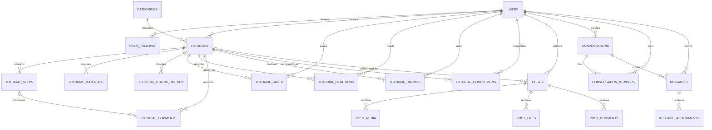

# Origami database design

The application uses MySQL through Spring Data JPA and Flyway. Authentication
and RBAC remain in migrations V1-V5. The application domain is introduced by:

- `V6__extend_user_profiles.sql`: public profiles and follows.
- `V7__create_origami_content_schema.sql`: tutorials, submissions, feed and
  completion history.
- `V8__create_chat_schema.sql`: direct/group messaging.
- `V9__create_registration_otp_table.sql`: short-lived email verification
  challenges used before a user account is created.

## Main decisions

1. `users.username` is the login email because the backend currently validates
   it with `@Email`. `users.handle` is the unique public username shown by the
   Flutter application. Profile fields remain nullable during onboarding so the
   registration flow can collect profile details before creating the account.
2. A submitted instruction and an approved library tutorial are the same row in
   `tutorials`. Its lifecycle is `DRAFT -> PROCESSING -> APPROVED/REJECTED`.
   Every transition is recorded in `tutorial_status_history`.
3. Images and files are stored in object storage; the database stores their
   URLs and metadata only. Flutter's local `XFile` must be uploaded before the
   content transaction is committed.
4. Likes, saves, reactions and follows use composite primary keys. This both
   prevents duplicate actions and makes toggling deterministic.
5. Follower, like, comment and rating totals are computed from relation tables.
   They should not be accepted from the client. Cached counters can be added
   later if profiling shows they are needed.
6. `tutorial_completions` allows multiple attempts. Each row is one achievement
   history item and can contain the finished model photo and actual duration.
7. `direct_key` is the two user IDs sorted ascending and joined with `:`, for
   example `12:93`. Its unique constraint prevents duplicate direct chats.
8. `registration_otps` is intentionally not linked to `users`: it represents an
   email address that has not been verified yet. Only an HMAC digest is stored;
   successful verification deletes the row in the same transaction that creates
   the user.

## Entity relationship diagram

## Application rules not expressible as a simple foreign key

- A `tutorial_comments.step_id`, when present, must point to a step belonging to
  the same `tutorial_id`.
- Before moving a tutorial from `DRAFT` to `PROCESSING`, the service must require
  description, difficulty, estimated duration and at least one step. Nullable
  columns allow incomplete drafts to be saved safely.
- Only `APPROVED` tutorials may be returned by the public library, reacted to,
  rated, saved or completed.
- A conversation sender must be an active member (`left_at IS NULL`) of that
  conversation.
- `messages.content` may be empty only when the message has an attachment.
- A direct conversation must have exactly two active members. A group must have
  at least one `OWNER`.
- Status transitions and their history row must be written in one transaction.

## Queries used by current screens

- Library: filter `tutorials` by `status = 'APPROVED'`, `deleted = FALSE`,
  category, difficulty and `estimated_minutes`; aggregate `tutorial_ratings` for
  the displayed average.
- Newsfeed: read published, non-deleted `posts` ordered by `created_at DESC`,
  then load `post_media`, like count and comment count in batched queries or a
  projection.
- Profile: count both directions of `user_follows`; list the user's posts,
  `tutorial_saves` and `tutorial_completions`.
- Creator Studio: list `tutorials` by `creator_id` and `status`; show moderation
  history and comments for the selected tutorial.

## Backend mapping note

Use Java enums persisted as strings (`EnumType.STRING`) for difficulty, tutorial
status, post status, conversation type and message type. Join tables such as
likes/saves/follows are best represented with composite IDs or explicit command
repositories. Do not expose JPA entities directly from controllers; DTOs should
carry URLs, derived counts and the current user's `liked/saved/following` flags.
